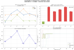
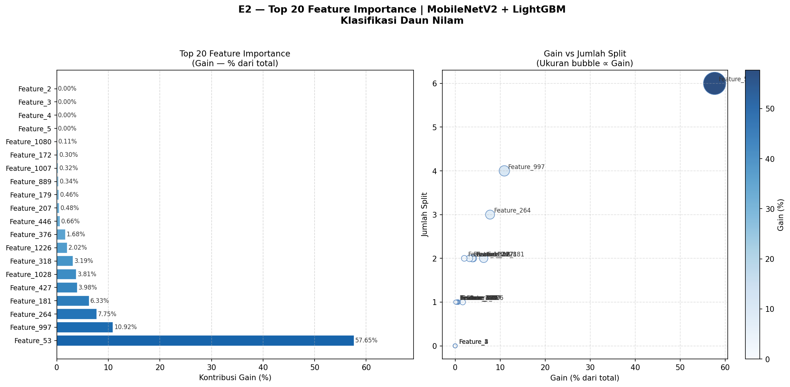
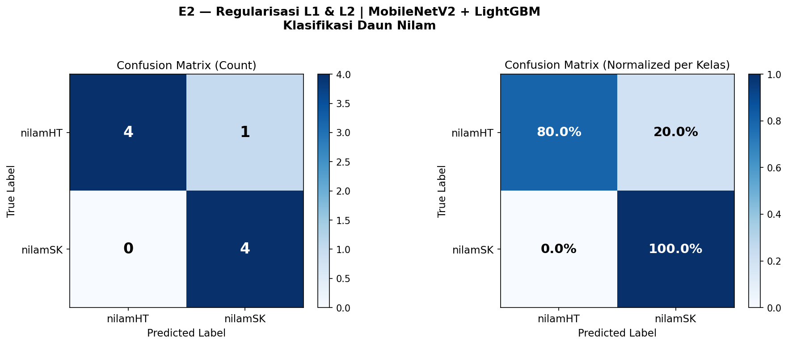

# Patchouli Leaf Disease Classification using Hybrid Deep Learning and LightGBM

## Overview
Patchouli (*Pogostemon cablin* Benth) is a high-value essential oil-producing plant widely cultivated in Indonesia. The productivity and quality of patchouli oil are highly influenced by leaf health conditions. Manual disease identification is often subjective, inconsistent, and highly dependent on farmers' experience.

This research proposes a hybrid artificial intelligence approach by combining:
- **MobileNetV2** as a deep learning-based feature extractor
- **LightGBM** as the main classification algorithm

The objective of this project is to evaluate the effectiveness and robustness of hybrid machine learning models for patchouli leaf disease classification.

---

## Research Objectives
- Develop a hybrid classification model using CNN feature extraction and gradient boosting classification.
- Evaluate classification performance on healthy and diseased patchouli leaf datasets.
- Analyze model robustness against complex and high-dimensional image features.
- Provide a lightweight and efficient model suitable for mobile-based deployment.

---

## Model Architecture

```text
Input Image
     ↓
Image Preprocessing
     ↓
MobileNetV2 (Feature Extraction)
     ↓
Extracted Feature Vector
     ↓
LightGBM Classifier
     ↓
Disease Classification Output
```

---

## Methodology

### 1. Data Collection
- Healthy and diseased patchouli leaf images collected directly from plantations.

### 2. Image Preprocessing
- Resize
- Normalization
- Data augmentation

### 3. Feature Extraction
- Pretrained MobileNetV2 used to extract deep image representations.

### 4. Classification
- LightGBM used as the final classifier.

### 5. Evaluation Metrics
- Accuracy
- Precision
- Recall
- F1-Score
- Confusion Matrix

---

## Experimental Results

### Hyperparameter Tuning Comparison



This figure compares model performance before and after LightGBM hyperparameter tuning.

---

### Feature Importance Analysis



Feature importance visualization generated from the LightGBM classifier.

---

### Confusion Matrix



Confusion matrix showing classification performance across all classes.

---

## Technologies Used

- Python
- TensorFlow / Keras
- MobileNetV2
- LightGBM
- Scikit-learn
- OpenCV
- NumPy
- Pandas
- Matplotlib

---

## Project Structure

```bash
Research-Patchouli_leaf_classification_model/
│
├── dataset/
├── notebooks/
├── models/
├── Nilam90/
│   ├── e2_feature_importance.png
│   ├── tuning_comparison.png
│   ├── e2_confusion_matrix.png
│
├── requirements.txt
└── README.md
```

---

## Installation

```bash
git clone https://github.com/4rch-Ey0Exe/Research-Patchouli_leaf_classification_model.git

cd Research-Patchouli_leaf_classification_model

pip install -r requirements.txt
```

---

## Future Development
- Mobile application integration
- Real-time disease detection
- Additional disease class expansion
- Model optimization for edge devices

---

## Research Contribution
This project demonstrates how hybrid AI models combining deep learning and gradient boosting can improve classification efficiency while maintaining computational performance suitable for real-world agricultural applications.

---

## Author
Developed by [Telkom University Research Team]

---

## License
This project is intended for research and educational purposes.
Unauthorized use or distribution is prohibited
